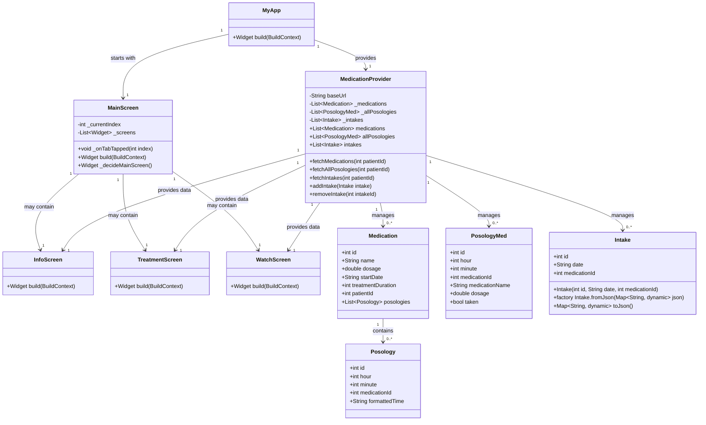
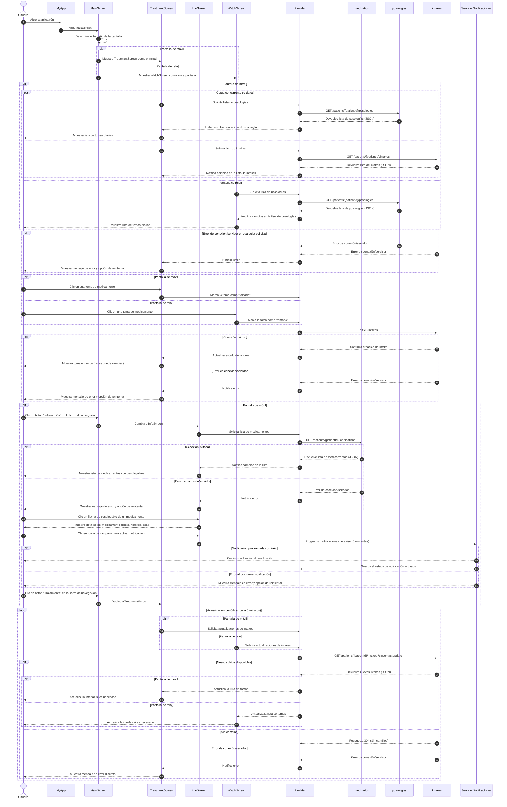

# Diseño Software
## Casos de Uso
- CU-01 Marcar Medicación como Tomada
- CU-02 Desmarcar Medicación como Tomada
- CU-03 Notificar para la Toma de Medicación

## Diseño Estático

## Diseño Dinámico

